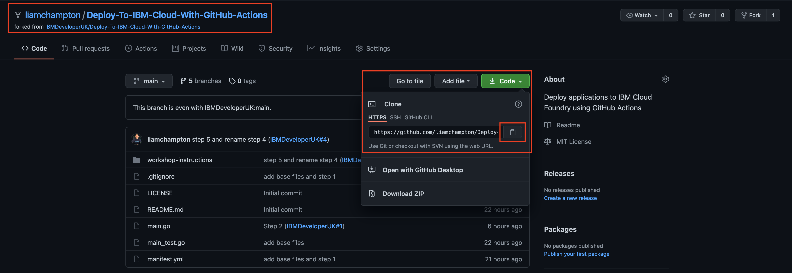

# Step 1 - Fork the GitHub repository
Start by forking this repository as shown below

Now you have a copy of the repository clone it onto your own machine into your GOPATH. This is usually `$HOME/go/src/github.com/` (This path is dependent on how you set up your Go installation).

`cd` into the project folder and check it works. Run the command `go run main.go` from within the root of the project.

If it is working correctly, you should see the terminal output `Hello World!`.

If you see an error check:

- Go is installed properly. To do this, run the terminal command `go version`. You should get an output similar to `go version go1.16 darwin/amd64`
- Refer to the [Go installation](https://golang.org/doc/install) guide and ensure you followed the installation steps correctly.

Finally, open the project folder in a code editor and set aside. We will need to make some changes to the files shortly.